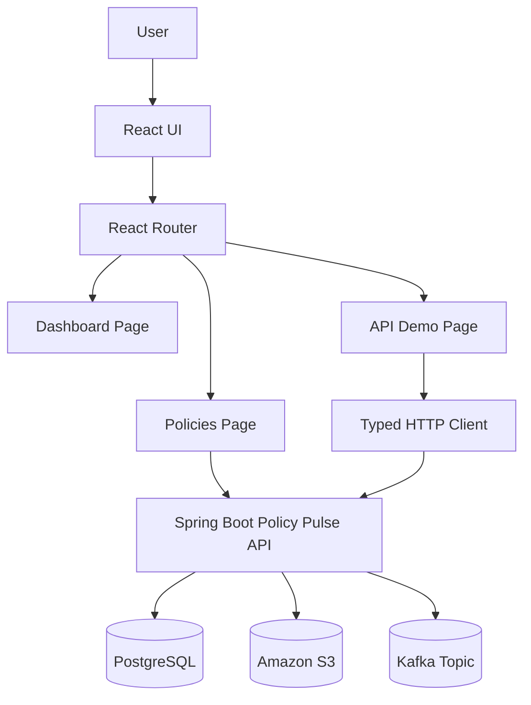

# Policy Pulse UI

Policy Pulse UI is a React + TypeScript frontend for the Policy Pulse application.

It connects to the Spring Boot Policy Pulse API and allows users to manage insurance policies, search policy records, upload policy documents, and download stored documents.

---

## Features

- View paginated policy records
- Create new policies
- Edit existing policy details
- Delete policies
- Search policies by status
- Upload policy documents
- Download policy documents
- Show loading and error states
- Track upload state for a selected policy
- Track download state for a selected policy
- Communicate with the Spring Boot REST API using the Fetch API
- Use TypeScript types for safer frontend development
- Route between Dashboard, Policies, API Demo, and 404 pages

---

## Tech Stack

| Area | Technology |
|---|---|
| Frontend | React |
| Language | TypeScript |
| Build Tool | Vite |
| Routing | React Router DOM |
| API Calls | Fetch API |
| Styling | CSS |
| Package Manager | npm |
| Backend Integration | Spring Boot REST API |

---

## Application Pages

| Page | Purpose |
|---|---|
| Dashboard | Displays high-level policy activity and sample operational metrics |
| Policies | Main page for policy CRUD, search, upload, and download |
| API Demo | Demonstrates typed API calls and Spring Boot-style error handling |
| Not Found | Handles invalid routes |

---

## Architecture



---

## Project Structure

```text
policy-pulse-ui
├── public
├── src
│   ├── api
│   │   ├── http.ts
│   │   └── problemDetails.ts
│   ├── assets
│   ├── pages
│   │   ├── ApiDemoPage.tsx
│   │   ├── DashboardPage.tsx
│   │   ├── NotFoundPage.tsx
│   │   └── PoliciesPage.tsx
│   ├── App.css
│   ├── App.tsx
│   ├── index.css
│   └── main.tsx
├── index.html
├── package.json
├── tsconfig.json
├── tsconfig.app.json
├── tsconfig.node.json
├── vite.config.ts
└── README.md
```

---

## Main Policy Type

The UI works with policy objects returned by the backend.

```ts
type PolicyStatus = "ACTIVE" | "PENDING" | "EXPIRED" | string;

type Policy = {
  id: number;
  policyNumber: string;
  holderName: string;
  status: PolicyStatus;
  premium: number;
  documentKey?: string | null;
};
```

Example policy:

```json
{
  "id": 1,
  "policyNumber": "POL101",
  "holderName": "John Doe",
  "status": "ACTIVE",
  "premium": 500.00,
  "documentKey": "1714450000000_policy.pdf"
}
```

---

## Backend API

The UI expects the Spring Boot backend to run on:

```text
http://localhost:8080
```

Main backend endpoints used by the UI:

| Method | Endpoint | Purpose |
|---|---|---|
| `GET` | `/api/policies?page=0&size=10` | Load paginated policies |
| `POST` | `/api/policies` | Create a policy |
| `PUT` | `/api/policies/{id}` | Update a policy |
| `DELETE` | `/api/policies/{id}` | Delete a policy |
| `GET` | `/api/policies/search?status=ACTIVE&page=0&size=10` | Search policies by status |
| `POST` | `/api/policies/{id}/document` | Upload a policy document |
| `GET` | `/api/policies/{id}/document` | Download a policy document |

---

## Application Flow

### Load Policies

```text
User opens Policies page
-> React calls GET /api/policies?page=0&size=10
-> Backend returns paginated policy data
-> UI displays policy records
```

### Search Policies

```text
User selects a status filter
-> UI resets page to 0
-> React calls GET /api/policies/search
-> Backend returns filtered policy records
-> UI displays matching policies
```

### Create Policy

```text
User enters policy details
-> UI sends POST /api/policies
-> Backend saves the policy
-> UI clears the form
-> UI reloads the policy list
```

### Update Policy

```text
User clicks Edit
-> UI fills the form with existing policy data
-> User updates values
-> UI sends PUT /api/policies/{id}
-> Backend updates the policy
-> UI reloads the policy list
```

### Delete Policy

```text
User clicks Delete
-> UI sends DELETE /api/policies/{id}
-> Backend deletes the policy
-> UI reloads the policy list
```

### Upload Document

```text
User selects a document file
-> UI creates FormData
-> UI sends multipart/form-data request to POST /api/policies/{id}/document
-> Backend uploads the file to Amazon S3
-> Backend stores only the S3 document key in PostgreSQL
-> Backend publishes a Kafka event
-> UI reloads the policy list
```

### Download Document

```text
User clicks Download
-> UI calls GET /api/policies/{id}/document
-> Backend returns file bytes
-> UI creates a browser download link
-> Browser downloads the file
```

---

## Important UI State

The Policies page manages these frontend states:

| State | Purpose |
|---|---|
| `policies` | Stores policies returned by the backend |
| `status` | Stores selected status filter |
| `page` | Tracks current page number |
| `size` | Tracks page size |
| `totalPages` | Stores total pages from backend response |
| `loading` | Shows loading state while fetching policies |
| `error` | Shows API error messages |
| `editingPolicyId` | Tracks whether the form is creating or editing |
| `uploadingPolicyId` | Tracks document upload progress for one policy |
| `downloadingPolicyId` | Tracks document download progress for one policy |
| `fileInputRefs` | Keeps hidden file inputs mapped by policy ID |

---

## Typed HTTP Client

The project includes a small typed HTTP helper under:

```text
src/api/http.ts
```

It supports:

- Default `GET` requests
- Custom HTTP methods
- JSON request bodies
- Request timeout handling
- JSON response parsing
- Spring Boot-style error parsing
- Throwing a custom `ApiError` for non-2xx responses

The error model is defined in:

```text
src/api/problemDetails.ts
```

It supports common Spring Boot `ProblemDetail` fields such as:

```text
type
title
status
detail
instance
timestamp
path
traceId
correlationId
errors
```

---

## Run Locally

### Install Dependencies

```bash
npm install
```

### Start Development Server

```bash
npm run dev
```

The UI runs on:

```text
http://localhost:5173
```

---

## Available Scripts

| Command | Purpose |
|---|---|
| `npm run dev` | Start Vite development server |
| `npm run build` | Compile TypeScript and build production assets |
| `npm run lint` | Run ESLint |
| `npm run format` | Format files using Prettier |
| `npm run preview` | Preview production build locally |

---

## Backend Requirement

Before using the UI, make sure the Policy Pulse API backend is running on:

```text
http://localhost:8080
```

The backend should allow CORS from:

```text
http://localhost:5173
```

---

## Example User Actions

### Create Policy

User enters:

```text
policyNumber = POL101
holderName = John Doe
status = ACTIVE
premium = 500.00
```

Then the UI sends:

```http
POST /api/policies
Content-Type: application/json
```

Example request body:

```json
{
  "policyNumber": "POL101",
  "holderName": "John Doe",
  "status": "ACTIVE",
  "premium": 500.00
}
```

---

### Upload Document

User selects a PDF or document file.

The UI sends the selected file as `multipart/form-data`.

```http
POST /api/policies/1/document
Content-Type: multipart/form-data
```

Form data:

```text
file = policy-document.pdf
```

The UI does not store the file. It only sends the file to the backend.

---

### Download Document

User clicks the Download button.

```http
GET /api/policies/1/document
```

The backend returns file bytes.

The UI reads the response as a `Blob`, creates a temporary download URL, and triggers the browser download.

---

## Notes

- The UI does not store policy documents.
- The actual document file is stored in Amazon S3 by the backend.
- PostgreSQL stores only the S3 document key.
- The UI only sends files to the backend and receives files back during download.
- The UI uses `fetch` to communicate with the backend.
- The current backend base URL is `http://localhost:8080`.
- The current frontend dev URL is `http://localhost:5173`.

---

## Future Improvements

- Move backend API base URL to an environment variable
- Add authentication and authorization
- Add better form validation
- Add confirmation modal before delete
- Add toast notifications
- Add sorting support
- Add advanced filters
- Add unit tests with React Testing Library
- Add end-to-end tests
- Improve responsive design
- Add reusable UI components
- Add loading skeletons
- Add stronger error display using backend `ProblemDetail` responses

---

## License

This project is for learning and full-stack development practice.
